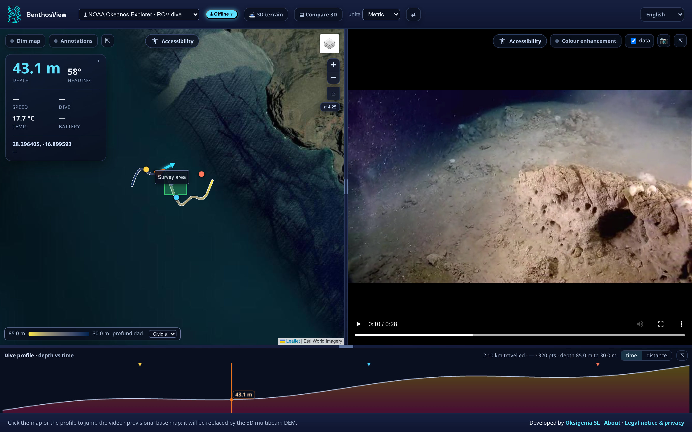
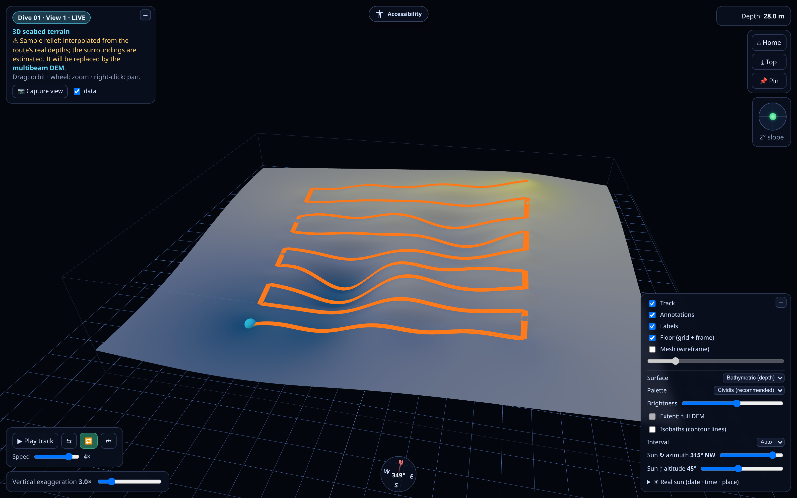
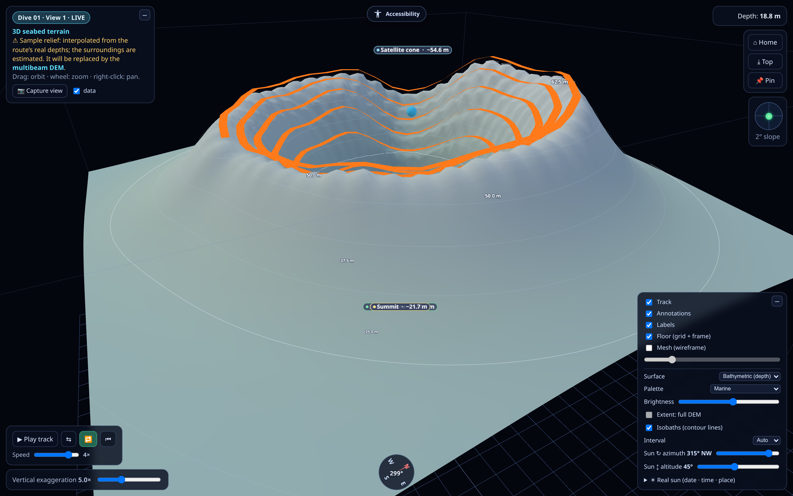
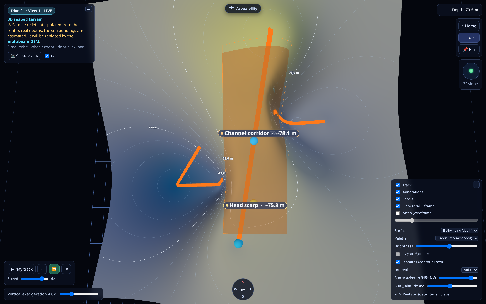
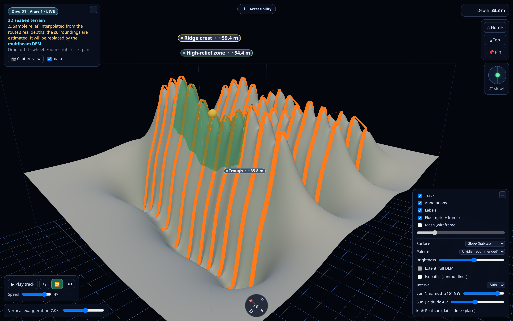
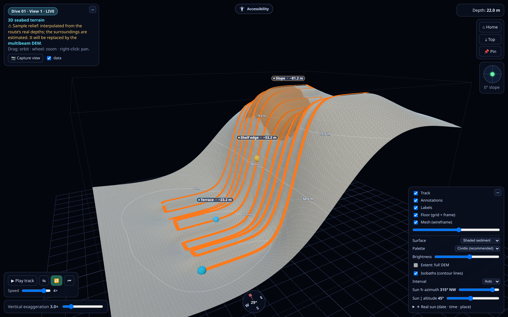

# BenthosView

**Georeferenced survey video, turned into a map you can explore.**

BenthosView links moving-camera footage to *where* it was filmed. An ROV dive, a diver
transect, a drone corridor — the video plays in sync with its track on the map, the 3D
terrain underneath, the depth and telemetry profile, and the annotations of the people
who know how to read them. A recording stops being a flat timeline and becomes a *place*
you can navigate.

It was born underwater — marine biology and benthic habitat mapping in the Canary
Islands — but the idea travels. It fits anywhere a camera goes that people can't easily
reach, and where *where you are* is half the data: **caves and lava tubes, forests and
wetlands, coastlines, tunnels and infrastructure, UAV/drone corridors.** If it is easier
to film a place than to walk it, Benthos turns the footage into a map you can read.

Built by **[Oksigenia SL](https://oksigenia.com)**.

The viewer at a glance: the survey transect at sea, synced video, live telemetry and the depth profile — all linked. Demo footage: NOAA Okeanos Explorer (public domain); track and annotations are synthetic.

> **This repository is the free viewer.** The engine that *creates* the content —
> ingest, georeferencing, user roles, GIS export, 3D from real elevation, cloud video —
> is the **Benthos platform**, and that is the product. You can hand anyone the viewer;
> the value is in generating what it shows. [Jump to the platform ↓](#the-benthos-platform)

---

## What the viewer does

- 🎥 **Everything in sync** — video, map track and 3D terrain move together, both ways:
  scrub the video and the marker follows on the map *and* in 3D; click the map, the 3D
  scene or the depth profile and the video jumps to that instant. One survey, three
  linked views.
- 🗺️ **2D track** over real cartography — satellite, bathymetry (EMODnet), orthophotos,
  nautical charts; layers switchable per view.
- ⛰️ **3D terrain** — orbit, tilt and zoom; vertical exaggeration, depth / slope /
  shaded-sediment surfaces, isobaths (contour lines), a compass and a live slope
  (inclination) readout.
- ☀️ **Light and hillshade** — steer the sun by azimuth and elevation, or set the *real*
  solar position from date, time and place, for hillshaded relief that reveals fine
  structure.
- 📍 **Georeferenced annotations** — points, segments and *areas*, with per-area depth
  statistics: species, habitats, substrates, anything worth marking.
- 📈 **Depth / elevation profile** — along the whole run, by distance or by time (works
  above water too, as a surface-elevation profile).
- 🌊 **Tide-aware depths** — soundings referenced to datum, with tide along the run.
- 📷 **Frame and 3D-view capture *with data*** — save a video frame or a 3D view with its
  coordinates (lat/long *and* UTM), depth, heading and CRS/datum baked in: survey-grade,
  not just a picture.
- 📐 **Units your way** — metric, imperial or nautical.

The same survey in 3D: reconstructed terrain, annotation points and areas, isobaths, depth palette and sun controls. *Synthetic data.*

## Works offline, everywhere — BenthosView Lite

The **view-only desktop app** (Windows · macOS · Linux) reads dives from a local folder
and runs **fully offline**. It is the deliverable you put in a client's hands: give them
the viewer plus a content folder and they explore their surveys with nothing online
required — no account, no server, no connection.

### Download

Installers are in **[Releases](https://github.com/OksigeniaSL/benthosview/releases)** —
Windows (`.exe` / `.msi`), macOS (`.dmg`), Linux (`.AppImage` / `.deb`).

> On Linux, H.264 playback needs the GStreamer codecs (`gstreamer1.0-libav`,
> `gstreamer1.0-plugins-good`); the `.deb` package already declares them.

## Speaks your language

Full interface in **six languages** — English, Spanish, Portuguese, French, German and
Italian — with an in-house i18n engine and per-user / per-install selection. Scientific
vocabulary is deliberately kept untranslated.

## Built to be accessible

Accessibility is a first-class feature, not an afterthought — and a hard requirement for
public-sector deployments. The interface ships with a **curated accessibility panel**
(text size, contrast, reduced motion, focus aids and more) on top of an
accessible-by-design base: keyboard navigation, semantic markup and screen-reader-friendly
controls.

## Gallery

The same 3D engine, different terrain, viewpoint, vertical exaggeration and surface
shading — bathymetric, slope (habitat) or shaded-sediment, with isobaths and a wireframe
mesh.

<table>
<tr>
<td width="50%"> <b>Submarine mount</b> — marine palette, isobaths, 5× exaggeration.</td>
<td width="50%"> <b>Top-down chart view</b> — channel corridor, contour lines.</td>
</tr>
<tr>
<td width="50%"> <b>High-relief ridges</b> — slope (habitat) shading, 7× exaggeration.</td>
<td width="50%"> <b>Shelf break</b> — wireframe mesh over shaded sediment.</td>
</tr>
</table>

All images use synthetic data — no client material.

---

## The Benthos platform

The viewer above is the window. **Benthos** is the workshop behind it — the product
institutions and companies license to *produce* georeferenced surveys, not just look at
them. It is self-hosted, one deployment per organization, and it stays yours: your data,
your infrastructure, your rules.

### Turn raw footage into a georeferenced survey
- **Compare up to four dives at once** — multiple 3D windows, **detachable** and
  independently controlled, side by side or across screens, all fed from the same synced
  video / map / 3D model.
- **Ingest & georeferencing** — match video to navigation telemetry, build the track,
  align every frame to a real-world position.
- **3D terrain from real elevation** — reconstruct the seafloor (or terrain) from actual
  DEM data, not a decorative surface.
- **Annotation workflows** — points, segments and areas with structured attributes;
  species, habitats and substrates recorded where they were seen, ready to export as data.

### Built for teams, built to interoperate
- **User roles & access control** — administrators, editors and viewers, with
  per-deployment configuration; custom roles on request. Sensitive footage stays behind
  authentication.
- **Export to any open format** — GeoJSON, GeoPackage, CSV, KML, Shapefile, with proper
  CRS/EPSG handling. On the roadmap: GeoTIFF with real DEM, OGC **WFS/WMS** services,
  **Darwin Core / OBIS** for biodiversity, and INSPIRE.
- **Connect straight from QGIS *and* ArcGIS** — Benthos can serve an **OGC API – Features**
  endpoint, so tracks and annotations open natively in the two leading GIS suites (one
  free and open, one proprietary), with live queries, styling and analysis on top — no
  manual file shuffling.
- **Multi-cloud video** — storage and streaming across Backblaze B2, Bunny and
  Cloudflare; choose per deployment, with no single-vendor lock-in.
- **Accessibility & branding** — accessibility controls for public-sector requirements,
  and per-deployment branding, language and map layers.

### Deliver it, offline
When the survey is done, Benthos exports the **BenthosView Lite** package above — the
viewer plus a content folder — so the final client explores the work with no server and
no connection. That offline deliverable is generated *from* the platform.

## Where it is going

The goal is a **living map of the seafloor** — and beyond: stop *adding* isolated dives
and start *composing* them, using AI and active learning to reconstruct the parts no
camera has reached yet. Underwater is the origin; the same idea holds anywhere a moving
camera meets a map.

---

## Work with us

Benthos is built to order for each organization — marine research institutes,
bathymetric and bionomic mapping, environmental monitoring, coastal and drone survey.
If you produce georeferenced video and need to turn it into data people can read,
explore and share:

- 🌐 **[oksigenia.com](https://oksigenia.com)**
- ✉️ **[info@oksigenia.com](mailto:info@oksigenia.com)**
- 💼 Oksigenia SL — infrastructure, self-hosted AI and data sovereignty.

*Get in touch to see the full platform, discuss a deployment, or request a demo.*

## About

Built by **[Oksigenia SL](https://oksigenia.com)**. Benthos is developed with, and for,
the people who actually read the seafloor.

## License

**© 2026 Oksigenia SL — all rights reserved.** BenthosView is proprietary software. The
binaries here are published free of charge for viewing Benthos content, and may not be
redistributed, modified or reverse-engineered. See **[LICENSE](LICENSE)**. The platform
source is kept private.
